# Midterm Java Technology

## 1. Sơ lược tổng quan về hệ thống

<h3><b> Data mẫu (bao gồm dữ liệu, 1 tài khoản admin và 1 tài khoản user):</b></h3> <b>thêm thủ công vào cơ sở dữ liệu trước khi sử dụng chương trình</b>
+ /resources/data.sql

### version:
+ IntellIJ IDEA 11
+ JDK 17
+ Spring 2.7.10

### Tài khoản ADMIN:
-   <b> Email: admin@gmail.com </b>
-   <b> Password: admin </b>
### Tài khoản USER:
-   <b> Email:</b> pham.duykhoa1303@gmail.com 
-   <b> Password:</b> khoa1303 

### Build Web Service Using:
+ backend: Spring Boot 2.7.10
+ frontend: Thymeleaf, only html,css,bootstrap
+ spring security
+ spring data jpa
+ mysql database
+ google oauth2

### Mô tả:
+ Web SpringEcommerce bán các thiết bị công nghệ, đối tượng sử dụng : 
  + Quản lý: CRUD tài khoản, sản phẩm, danh mục sản phẩm trong hệ thống.
  + Khách hàng: xem, tìm kiếm sản phẩm, tạo giỏ hàng, thanh toán hóa đơn.
  
+ Mô hình và phương pháp phát triển:
  + sử dụng mô hình MVC để dễ phát triển và bảo trì.
  + phương pháp phát triển chủ yếu là để sẽ tạo ra các service cần thiết cho hệ thống như một @bean
    kết nối với database và sau đó sử dụng trong controller để lấy dữ liệu và trả về cho view.
    
+ Cấu trúc mã:
  + project sẽ chia các package với các tính năng tương ứng, ví dụ như package controler sẽ có nhiệm vụ xử lý các logic hệ thống, package configuration có nhiệm vụ cấu hình các cài đặt cho hệ thống,...
  + khi chương trình được khởi động thì các model tương ứng với các bảng sẽ tự được tạo ra.

### Tính năng:
+ phân quyền admin, user
+ đăng nhập qua google hoặc basic
+ bảo mật: có một số trang người dùng đăng nhập rồi mới cho vào
+ quản lí sản phẩm, loại sản phẩm, tài khoản(CRUD)
+ xem sản phẩm, xem chi tiết
+ quản lí giỏ hàng (thêm, xóa, sửa)
+ tạo hóa đơn
+ tìm kiếm sản phẩm
#### Admin section:
+ quản lý sản phẩm
+ quản lý danh mục sản phẩm
+ quản lý tài khoản
#### User section:
+ xem trang sản phẩm
+ tìm kiếm sản phẩm
+ xem chi tiết sản phẩm
+ quản lý giỏ hàng

### Các tính năng và công nghệ sẽ phát triển:
+ phân trang
+ áp dụng công nghệ ajax để web mượt mà hơn

## 2. Sơ đồ quan hệ thực thể cho hệ thống:

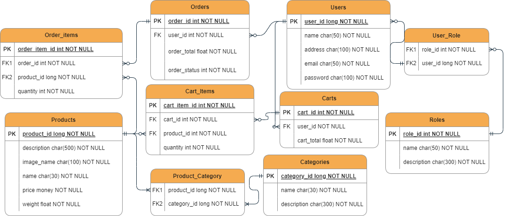

### Quan hệ của các thực thể trong hệ thống:
+ quan hệ giữa roles và users là many - many: một người có thể có nhiều role và mỗi role có có thể có nhiều người có.
+ quan hệ giữa products categories là many - many: một sản phẩm có thể có nhiều loại và mỗi loại có nhiều sản phẩm.
+ quan hệ giữa users và orders là 1 - many: một user có thể có nhiều order, nhưng mỗi order chỉ tồn tại và thuộc về một user.
+ quan hệ giữa users và carts là 1 - many: một user có thể có nhiều giỏ hàng, nhưng mỗi giỏ hàng chỉ tồn tại và thuộc về một user.
+ quan hệ giữa orders và order_items là 1 - many: một order có thể có nhiều sản phẩm
+ quan hệ giữa order_items và products là many - 1: order_item có thể có nhiều product
+ quan hệ giữa carts và carts_item tương tự orders và order_items
+ quan hệ giữa cart_items và product tương tự quan hệ order_items và product

### Về phần cơ sở dữ liệu:
+ Tạo 3 trigger cho update, add, delete trên cart_items sao cho cart_total của thực thể Cart luôn đúng với giá trị quantity*price của tất cả sản phẩm trong giỏ hàng.
+ Đảm bảo tính toàn vẹn dữ liệu cho hệ thống.
+ Sử dụng transaction: Khi người dùng chưa có giỏ hàng hoặc khi thanh toán thì bảng cart hoặc order sẽ được tạo ra trước
rồi mới đến các bảng items vì vậy đảm bảo được tính toàn vẹn dữ liệu.
  
## 3. POSTMAN
Một số api endpoint đòi hỏi người dùng cần phải đăng nhập và đúng phân quyền thì mới có truy cập được. Tham số đầu vào cho tất cả các endpoints đều có định dạng là JSON.
Mô tả chi tiết về các api endpoints như sau:

<h3>ProductAPI:</h3>

+ Phân quyền bên Admin:
  
  + [DELETE] /api/products/{id}  ---  xóa sản phẩm dựa trên id truyền vào
    
    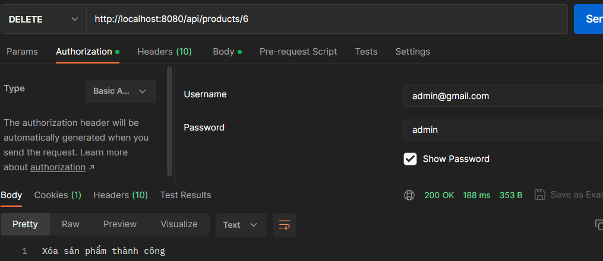
    
  + [PUT] /api/products/  ---  chỉnh sửa sản phẩm dựa vào id truyền vào
    
    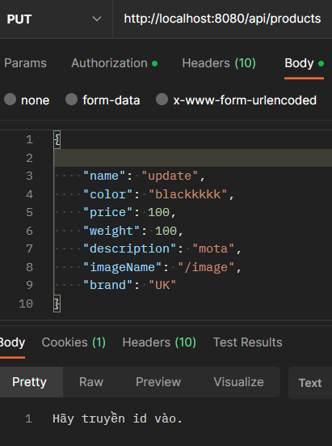
    none_id
    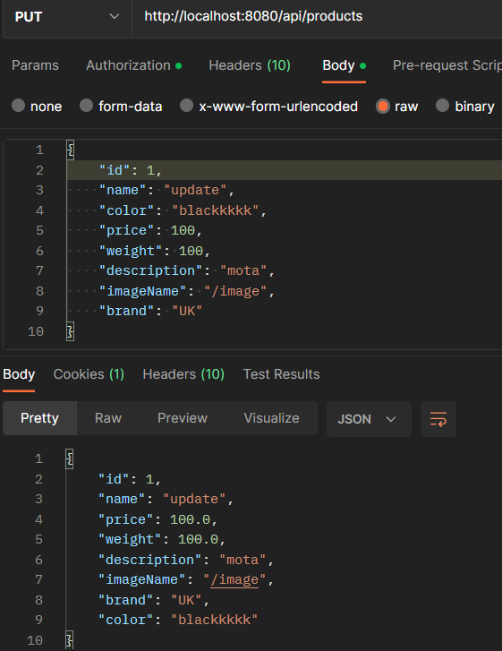
    have_id
    
  + [POST] /api/products/  ---  thêm sản phẩm
    
    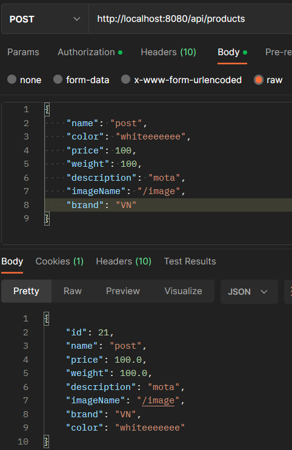

+ Phân quyền cả User và Admin: 
  
  + [GET] /api/products/ --- get tất cả sản phẩm
    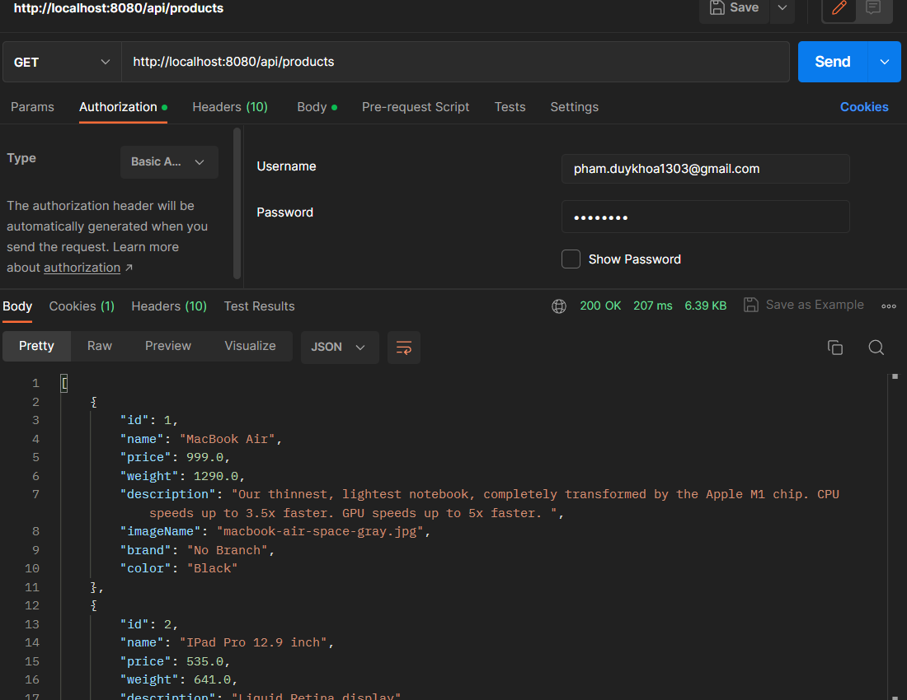
  + [GET] /api/products/category/{id}  --- get sản phẩm theo category id
    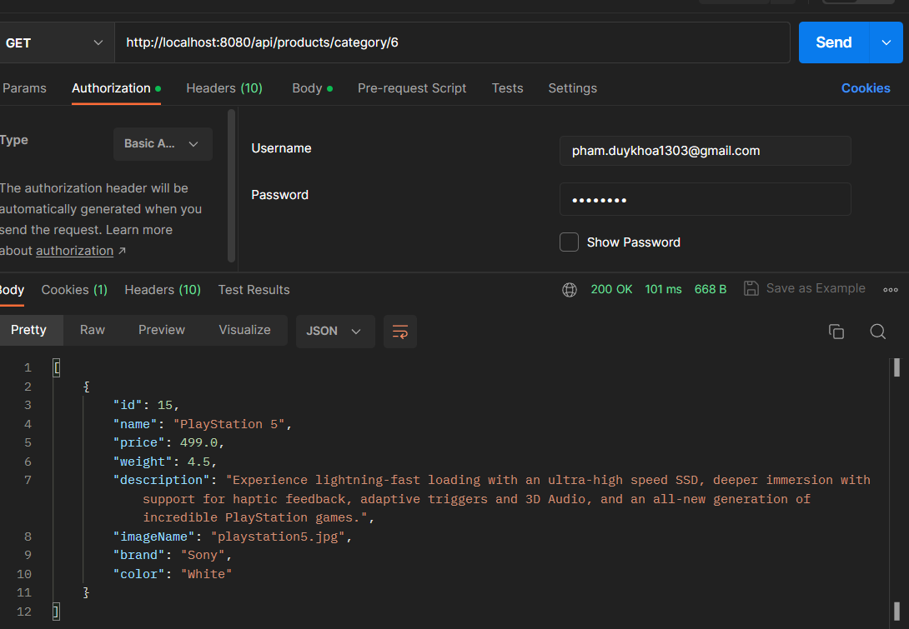
  + [GET] /api/products/{id}  ---  get sản phẩm theo id
    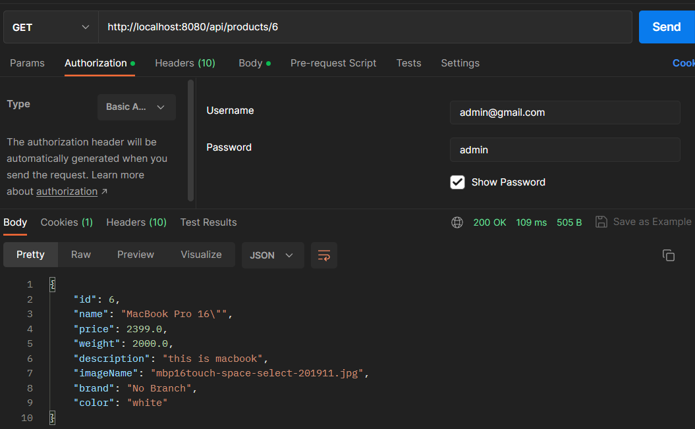
    
<h3>CartAPI:</h3>

+ Phân quyền bên Admin:
  
  + [GET] /api/carts ---- Lấy tất cả giỏ hàng
    
    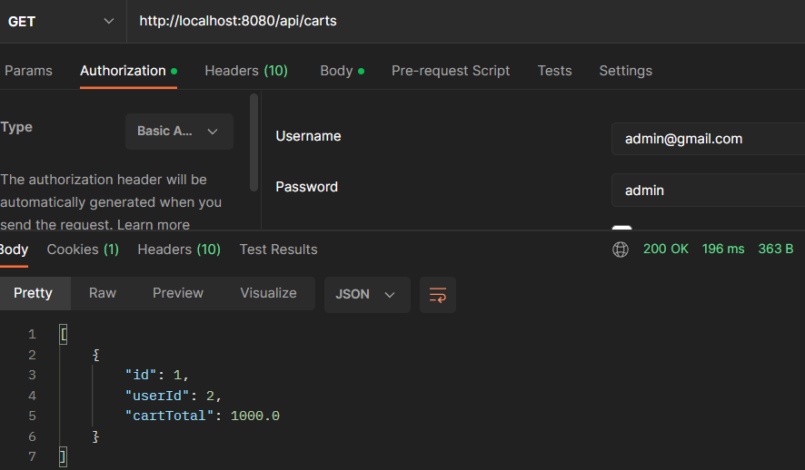
    
  + [GET] /api/carts/user/{userId} ----Lấy thông tin giỏ hàng theo user_id
    
    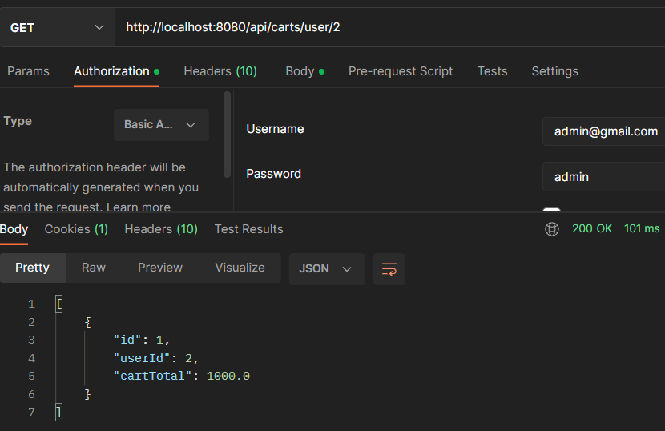
  
+ Phân quyền bên User:
  
  + [POST] /api/carts ---- Tạo giỏ hàng mới
    
    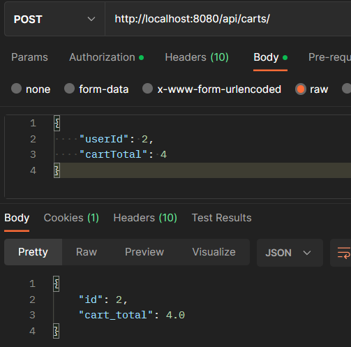
    
  + [PUT] /api/carts/{cartId} ---- Cập nhật thông tin giỏ hàng
    
    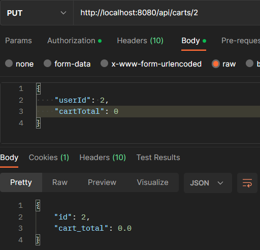
    
  + [DELETE] /api/carts/{cartId} ---- Xóa giỏ hàng theo ID
    
    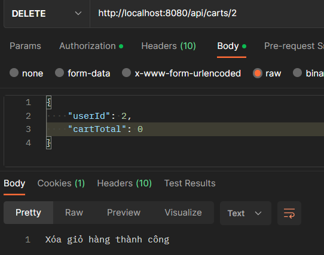
    
  + [POST] /api/carts/{cartId}/cart-item ---- Thêm sản phẩm vào giỏ hàng
    
    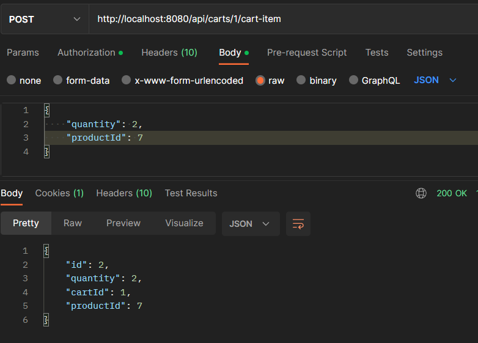
    
  + [PUT] /api/carts/{cartId}/cart-item/{cartItemId} ----Cập nhật thông tin sản phẩm trong giỏ hàng
    
    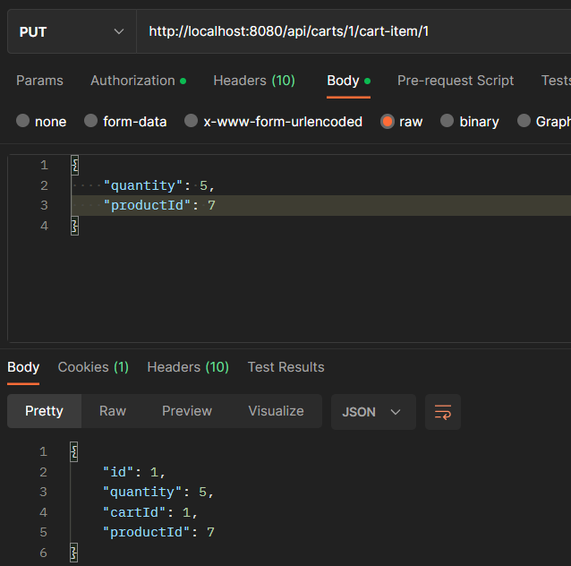
    
  + [DEL] /api/carts/{cartId}/cart-item/{cartItemId}----Xóa sản phẩm khỏi giỏ hàng
    
    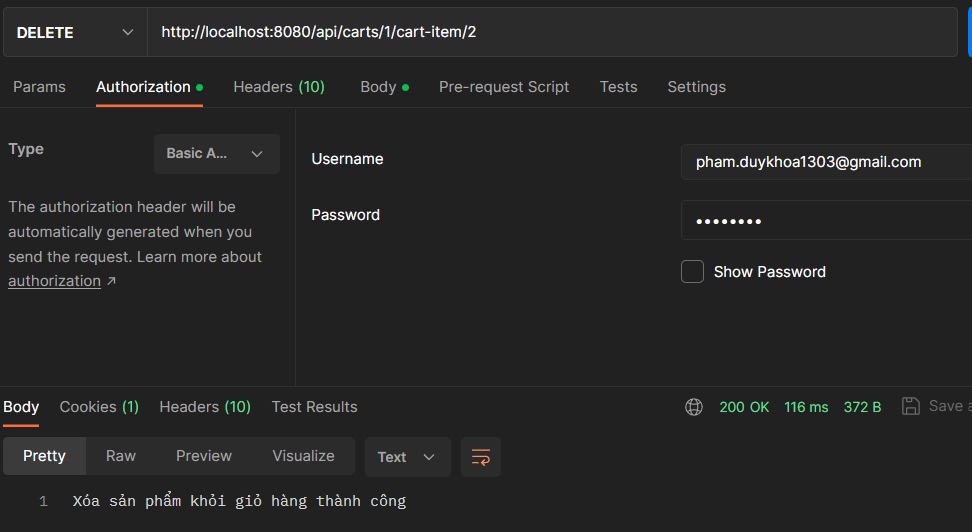
  

+ Phân quyền cả User và Admin:
  + [GET] /api/carts/{cartId}----Lấy thông tin giỏ hàng theo ID
    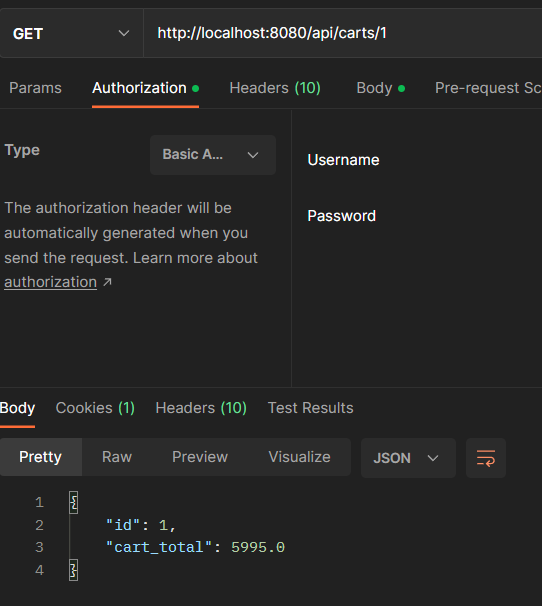

## 4. Chạy hệ thống

+ B1: Set port chạy ở 3307: <b>jdbc:mysql://localhost:3307/springcommerce</b>
+ B2: Tạo database springcommerce trên hệ quản trị mysql
+ B3: chạy chương trình
+ B4: truy cập vào 1 trong 2 tài khoản:
  + Admin: admin@gmail.com - admmin
  + User: pham.duykhoa1303@gmail.com - khoa1303 hoặc đăng nhập bằng google, hoặc đăng ký
  
Các điểm cần lưu ý:
+ Khi đăng nhập bằng google mặc định chưa có địa chỉ, khi mua hàng sẽ bắt người dùng nhập địa chỉ và lưu lại địa chỉ đó cho các lần sau.
+ Nếu người dùng thay đổi thông tin hóa đơn giao hàng như địa chỉ, số điện thoại thì thông tin tài khoản đó cũng sẽ thay đổi theo.